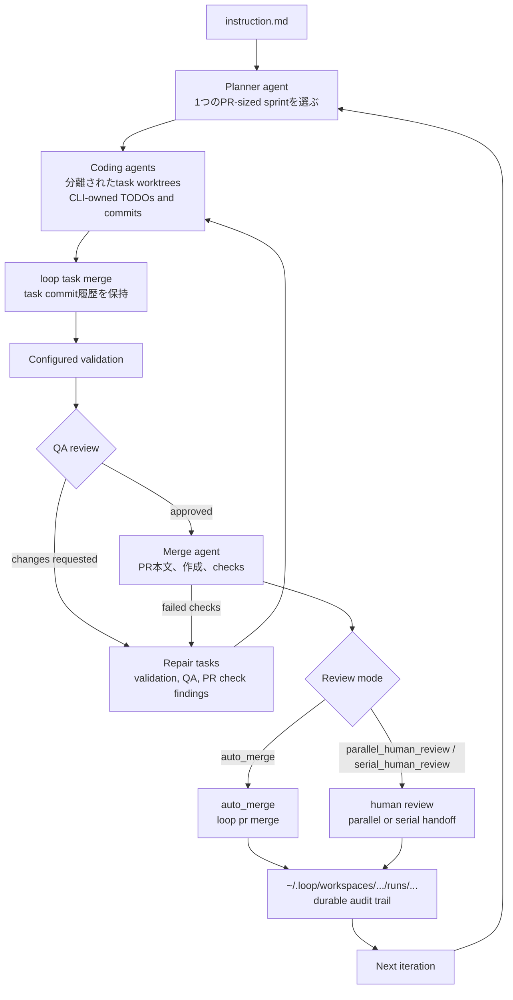

<h1 align="center">loop</h1>

<p align="center">1つのリポジトリ指示を、計画、実装、レビュー、PR統合まで続くエージェント作業に変えるCLI。</p>

<p align="center">
  <a href="README.md">English</a> |
  <a href="#quick-start">Quick Start</a> |
  <a href="#仕組み">仕組み</a> |
  <a href="#レビュー方式">レビュー方式</a> |
  <a href="#contributing">Contributing</a> |
  <a href="#開発">開発</a>
</p>

<p align="center">
  <a href="https://pkg.go.dev/github.com/aki-0421/loop"></a>
</p>

<p align="center">
  
</p>

`loop` は、1回のプロンプトでは足りないリポジトリ作業のための、Gitネイティブな自律コーディングハーネスです。ユーザーはMarkdownの指示ファイルを1つ渡します。`loop` はその指示をもとに、プランナーが選んだスコープ、タスク分割、検証、QAレビュー、PR統合までを繰り返します。

目的は、エージェントに好き放題編集させることではありません。自律的なコーディングに、良いエンジニアリング作業と同じ形を持たせることです。スコープのあるブランチ、タスク単位のコミット、検証結果、レビュー指摘、Pull Requestのチェック、マージ記録、あとで読めるログを残します。

## なぜ作ったか

多くのコーディングエージェントは、プロンプト1回分の作業には強いです。一方で、実際のリポジトリにはその外側の仕組みが必要です。

`loop` はその外側を担当します。

- プランナーが、リポジトリのsource of truthから1つのAI sprint-sized PRを選ぶ。
- コーディングエージェントは分離されたtask worktreeで動き、CLI管理のTODOとcommitコマンドを使う。
- CLIが完了したtask branchをiteration branchへ統合し、task commitの履歴を保持する。
- 設定されたvalidationをレビュー前に実行する。
- QA review agentが統合済みブランチを確認し、必要なら具体的な修正指摘を返す。
- merge agentがPR本文、PR作成、check待機、merge、またはhuman reviewへの引き渡しを`loop`コマンドで担当する。
- すべてのrunが、あとから調査できる`~/.loop/workspaces/<repo-id>/` artifactsを残す。

## Dashboard

interactive dashboardは、現在のrole、token counts、task progress、review mode、最新のagent message、task TODOs、PR metadata、check progressを、runが進んでいる間も表示します。

<p align="center">
  
</p>

## Quick Start

前提:

- Gitリポジトリ。
- Go 1.25以上。
- default skill installation用に`npx`が使えるNode.js/npm環境。
- 対応しているagent CLI。default adapterは`codex exec --json`を実行します。
- PR統合、GitHub Issues、GitHub-backed memory syncを使う場合は、認証済みのGitHub CLI (`gh`)。

インストール:

```sh
go install github.com/aki-0421/loop/cmd/loop@latest
```

リポジトリを初期化:

```sh
loop init
```

指示ファイルを作成:

```md
# Instructions

Act as a senior coding agent for this repository.

Advance the product from the repository source of truth. Read the docs, specs,
tests, examples, and nearby code before choosing work. Pick one coherent
PR-sized development goal at a time. Preserve existing architecture, add
focused validation, and avoid unrelated refactors.
```

まずは人間が確認する1 iterationだけ実行:

```sh
loop run task.md --pr --human-review --max-iterations 1
```

その後、自律的に進める:

```sh
loop run task.md --pr
```

defaultでは`run.maxIterations`は`0`で、iteration数に上限はありません。`--goal`がない場合、`loop`はinterrupt、設定されたlimit、terminal errorのいずれかで止まるまで、次のcoherent sprintを選び続けて統合します。

終了条件を明示したい場合:

```sh
loop run task.md \
  --goal "The authentication tests are implemented and configured validation passes" \
  --pr
```

空ではない`--goal`がある場合、plannerとQA review handoffは`goal_complete=true`を返せます。CLIは、そのgoalを満たしたiterationが正常に統合されたあとでのみ停止します。

## 仕組み



1 iterationは1つのAI sprint-sized pull requestに対応します。plannerは、自律実行に向いていて、かつ独立してmergeできる最大のcoherent development goalを選びます。task boundaryは、依存関係、衝突回避、検証、並列化のために使われます。ファイル単位の細かすぎる作業分解が目的ではありません。

coding agentは、Git lifecycleを自由に操作しません。`loop task todo`、`loop task merge`、role commandを使うことで、commit、merge、cleanup、audit stateをCLIが一貫して管理します。coding taskが`loop task merge`成功前に終了した場合、CLIはそのattemptを未統合として扱い、task branchとworktreeを破棄して、設定に応じてretryまたはreplanします。

## レビュー方式

PRまわりの自律度を選べます。

```sh
# 完全自律: PRを作成し、checkを待ち、mergeする。
loop run task.md --pr --review-mode auto_merge

# 人間がレビューする間も、安全な非重複作業を続ける。
loop run task.md --pr --review-mode parallel_human_review

# PRを1つずつ人間がレビューする。
loop run task.md --pr --review-mode serial_human_review
```

`--human-review`は`--review-mode serial_human_review`の互換ショートカットです。

interactive rendererでは、PR run中に`r`を押すと`auto merge`、`parallel review`、`serial review`を切り替えられます。PR統合中は、PR branch metadataとlive check progressも表示します。

## 何が残るか

`loop init`後、repositoryには設定だけが残ります。

```text
.loop/config.yaml
```

run後、durable evidenceとtemporary worktreesはdefaultでrepository外に残ります。

```text
~/.loop/workspaces/<repo-id>/
  runs/
  worktrees/
  locks/
  tmp/
  loop.db
```

iteration artifactには、instruction snapshot、effective config、agent event logs、task tree、task result、task merge audit、validation evidence、QA review result、merge result、PR state、PR checks、errors、GitHub update summariesが含まれます。

このaudit trailはlocalでdurableに残りますが、repository worktreeの外に置かれるため、file watcherや外部workspace toolがloop-created worktreeを再帰的に追いかけません。`LOOP_HOME`で`~/.loop` rootを上書きできます。

## 自律ルール

- `loop run`はdefaultで自動実行され、ユーザーへ直接質問して止まりません。
- 安全な場合、エージェントは明示的なlocal assumptionを置いて進めます。
- 重要なproduct、policy、大きなblocking questionは`loop issue ask`でGitHub Issuesとして作成します。
- `parallel_human_review`では、pending PRを記録し、後続plannerが重複作業を避けたり、既存PR branchでreview feedbackを修正したりできます。
- `serial_human_review`では、現在のhuman-reviewed PRがmergeされるまで次のiterationを始めません。
- PR check failureはQA review findingではなく、merge-agent repair findingとして扱います。

## コマンド

人間向けコマンド:

| Command | Purpose |
| --- | --- |
| `loop init` | repository-local configを作成し、default skillを`npx skills`経由でインストールする。 |
| `loop run <instruction.md>` | 自律的なcoding iterationを実行する。 |
| `loop status [run-id]` | 現在または指定runの状態を表示する。 |
| `loop logs <run-id>` | run artifactを確認する。 |
| `loop version` | build version、commit、dateを表示する。 |

通常のhelp:

```sh
loop help
```

agent subprocessには`LOOP_AGENT_CONTEXT=1`が渡されるため、同じhelp commandでcompactなagent-facing command referenceが表示されます。role agentは現在の契約を次のコマンドで再確認できます。

```sh
loop role instruction
```

## 設定

`loop init`は小さな`.loop/config.yaml`を書きます。残りはbuilt-in defaultsが補います。

重要なdefault:

- `agent.default`は`codex`。
- Pull request integrationがdefault workflow。
- `run.maxIterations`は`0`で、unlimitedを意味する。
- `run.maxParallelTasks`は`2`。
- validation commandsはrepository-ownedで、設定されるまで空。

よく使う設定は[configuration guide](docs/configuration.md)、完全な契約は[configuration specification](spec/03-configuration.md)を参照してください。

## Contributing

issueやpull requestを作る前に[CONTRIBUTING.md](CONTRIBUTING.md)を読んでください。

`loop`は[Apache License 2.0](LICENSE)でライセンスされています。

## 開発

`make`をentry pointとして使います。

```sh
make test
make build
make verify
make ci
```

local snapshot build:

```sh
make release-snapshot
```

## Project Docs

- [Specification index](spec/00-index.md)
- [System contract](spec/01-system-contract.md)
- [CLI contract](spec/02-cli.md)
- [Configuration guide](docs/configuration.md)
- [Configuration specification](spec/03-configuration.md)
- [Iteration workflow](spec/06-iteration-workflow.md)
- [Git and PR workflow](spec/07-git-and-pr.md)
- [Memory and logs](spec/08-memory-and-logs.md)
- [Go implementation notes](spec/13-go-implementation.md)
- [Pull request template](.github/PULL_REQUEST_TEMPLATE.md)
