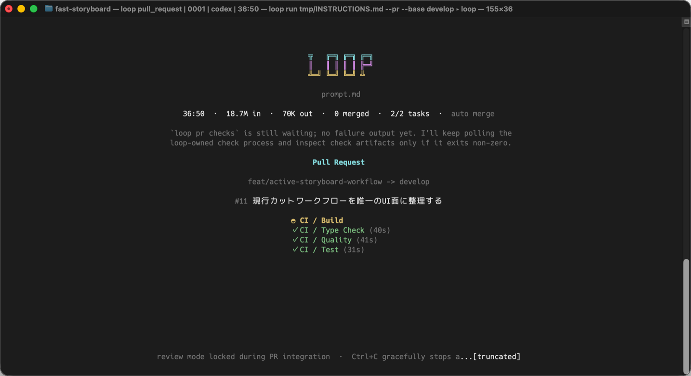
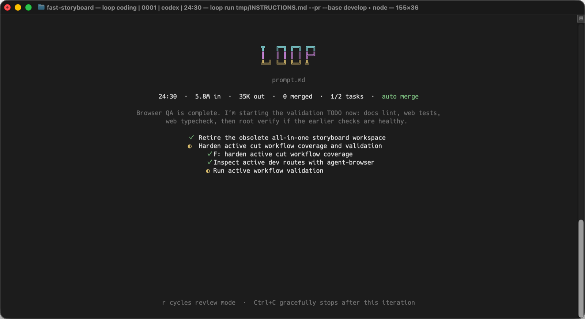
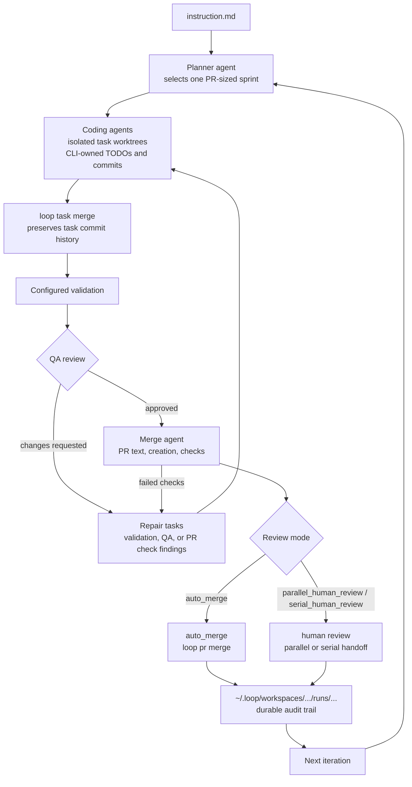

<h1 align="center">loop</h1>

<p align="center">Turn one repository instruction into a stream of planned, reviewed, pull-requested agent work.</p>

<p align="center">
  <a href="README.ja.md">日本語</a> |
  <a href="#quick-start">Quick Start</a> |
  <a href="#how-it-works">How It Works</a> |
  <a href="#review-modes">Review Modes</a> |
  <a href="#contributing">Contributing</a> |
  <a href="#development">Development</a>
</p>

<p align="center">
  <a href="https://pkg.go.dev/github.com/aki-0421/loop"></a>
</p>

<p align="center">
  
</p>

`loop` is a Git-native autonomous coding harness for repositories where the next useful change is bigger than a single prompt. You give it one Markdown instruction file. It keeps turning that instruction into planner-selected, task-split, validated, QA-reviewed, PR-integrated iterations.

The point is not to let an agent spray edits across your repo. The point is to give autonomous coding the shape good engineering work already has: scoped branches, task commits, validation evidence, review findings, pull request checks, merge records, and logs you can audit later.

## Why It Exists

Most coding agents are good at working inside a prompt-sized window. Real repositories need more structure than that.

`loop` adds the outer harness:

- A planner chooses one coherent AI sprint-sized PR from the repository source of truth.
- Coding agents run in isolated task worktrees and use CLI-owned TODO and commit commands.
- The CLI merges completed task branches into the iteration branch while preserving task commit history.
- Configured validation runs before review.
- A QA review agent checks the integrated branch and returns concrete repair findings when needed.
- A merge agent owns PR text, PR creation, check waiting, merge, or human-review handoff through `loop` commands.
- Every run leaves durable local artifacts under `~/.loop/workspaces/<repo-id>/` so you can inspect what happened.

## Dashboard

The interactive dashboard keeps the current role, token counts, task progress, review mode, latest agent message, task TODOs, PR metadata, and check progress visible while the run continues.

<p align="center">
  
</p>

## Quick Start

Prerequisites:

- A Git repository.
- Go 1.25 or newer.
- Node.js/npm with `npx` available for default skill installation.
- A supported agent CLI on `PATH`; the default adapter runs `codex exec --json`.
- GitHub CLI (`gh`) authenticated when using PR integration, GitHub Issues, and GitHub-backed memory sync.

Install:

```sh
go install github.com/aki-0421/loop/cmd/loop@latest
```

Initialize your repository:

```sh
loop init
```

Create an instruction file:

```md
# Instructions

Act as a senior coding agent for this repository.

Advance the product from the repository source of truth. Read the docs, specs,
tests, examples, and nearby code before choosing work. Pick one coherent
PR-sized development goal at a time. Preserve existing architecture, add
focused validation, and avoid unrelated refactors.
```

Run one inspected iteration first:

```sh
loop run task.md --pr --human-review --max-iterations 1
```

Then let it keep moving:

```sh
loop run task.md --pr
```

By default, `run.maxIterations` is `0`, which means no iteration cap. Without a `--goal`, `loop` keeps selecting and integrating the next coherent sprint until an interrupt, configured limit, or terminal error stops the run.

For a bounded run:

```sh
loop run task.md \
  --goal "The authentication tests are implemented and configured validation passes" \
  --pr
```

With a non-empty `--goal`, planner and QA review handoffs may report `goal_complete=true`; the CLI stops only after the satisfying iteration has integrated successfully.

## How It Works



One iteration maps to one AI sprint-sized pull request. The planner picks the largest coherent development goal suitable for autonomous work while still producing an independently mergeable result. Task boundaries are for dependency ordering, conflict avoidance, validation, and parallelism; they are not tiny file-by-file chores.

Coding agents do not freehand lifecycle Git commands. They use `loop task todo`, `loop task merge`, and related role commands so commits, merges, cleanup, and audit state stay consistent. If a coding task exits before `loop task merge` succeeds, the CLI treats that attempt as unmerged work, discards the task branch and worktree, and retries or replans according to configuration.

## Review Modes

Choose how much control to keep around pull requests:

```sh
# Full autonomy: create, check, and merge each PR.
loop run task.md --pr --review-mode auto_merge

# Human review while loop continues safe non-overlapping work.
loop run task.md --pr --review-mode parallel_human_review

# Human review one PR at a time.
loop run task.md --pr --review-mode serial_human_review
```

`--human-review` is a compatibility shortcut for `--review-mode serial_human_review`.

In the interactive renderer, press `r` during PR runs to cycle between `auto merge`, `parallel review`, and `serial review`. The renderer also shows PR branch metadata and live check progress during PR integration.

Use `--merge-method merge_commit` or `git.integration.mergeMethod: merge_commit` when you want the final iteration boundary to remain as a `--no-ff` merge commit. The default `squash` method writes the iteration's internal commit list into the squash commit body.

## What You Get Back

After `loop init`, the repository keeps only the repository-local config:

```text
.loop/config.yaml
```

After a run, durable evidence and temporary worktrees live outside the repository by default:

```text
~/.loop/workspaces/<repo-id>/
  runs/
  worktrees/
  locks/
  tmp/
  loop.db
```

Iteration artifacts include instruction snapshots, effective config, agent event logs, task trees, task results, task merge audits, validation evidence, QA review results, merge results, PR state, PR checks, errors, and GitHub update summaries.

That audit trail is intentionally local and durable, but kept out of the repository worktree so file watchers and external workspace tools do not recurse through loop-created worktrees. Set `LOOP_HOME` to override the `~/.loop` root.

## Autonomy Rules

- `loop run` is automated by default and does not stop to ask the user questions directly.
- Agents make explicit local assumptions when safe.
- Important product, policy, or large blocking questions go through `loop issue ask`, which creates GitHub Issues.
- In `parallel_human_review`, pending PRs are tracked so later planners can avoid overlapping work or repair review feedback on the existing PR branch.
- In `serial_human_review`, `loop` waits for the current human-reviewed PR to merge before starting another iteration.
- PR check failures become merge-agent repair findings, not QA review findings.

## Commands

Human-facing commands:

| Command | Purpose |
| --- | --- |
| `loop init` | Create repository-local config and install the default skill through `npx skills`. |
| `loop run <instruction.md>` | Run autonomous coding iterations. |
| `loop status [run-id]` | Show current or selected run state. |
| `loop logs <run-id>` | Inspect run artifacts. |
| `loop version` | Print build version, commit, and date. |

Run:

```sh
loop help
```

Agent subprocesses receive `LOOP_AGENT_CONTEXT=1`, so the same help command exposes the compact agent-facing command reference. Role agents can refresh their current contract with:

```sh
loop role instruction
```

## Configuration

`loop init` writes a small `.loop/config.yaml`; built-in defaults supply the rest.

Important defaults:

- `agent.default` is `codex`.
- Pull request integration is the default workflow.
- Iteration merge method is `squash`.
- `run.maxIterations` is `0`, meaning unlimited.
- `run.maxParallelTasks` is `2`.
- Validation commands are repository-owned and empty until configured.

See [the configuration guide](docs/configuration.md) for common overrides and [the configuration specification](spec/03-configuration.md) for the full contract.

## Contributing

Contributions are welcome. Read [CONTRIBUTING.md](CONTRIBUTING.md) before opening an issue or pull request.

`loop` is licensed under the [Apache License 2.0](LICENSE).

## Development

Use `make` as the entry point:

```sh
make test
make build
make verify
make ci
```

Create a local snapshot build:

```sh
make release-snapshot
```

## Project Docs

- [Specification index](spec/00-index.md)
- [System contract](spec/01-system-contract.md)
- [CLI contract](spec/02-cli.md)
- [Configuration guide](docs/configuration.md)
- [Configuration specification](spec/03-configuration.md)
- [Iteration workflow](spec/06-iteration-workflow.md)
- [Git and PR workflow](spec/07-git-and-pr.md)
- [Memory and logs](spec/08-memory-and-logs.md)
- [Go implementation notes](spec/13-go-implementation.md)
- [Pull request template](.github/PULL_REQUEST_TEMPLATE.md)
