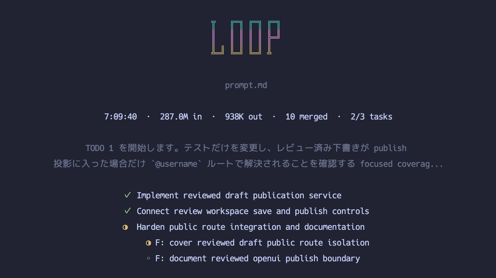

<h1 align="center">loop</h1>

<p align="center">A Git-native harness for autonomous AI coding sprints.</p>

<p align="center">
  <a href="#quick-start">Quick Start</a> |
  <a href="#the-model">The Model</a> |
  <a href="#project-docs">Docs</a> |
  <a href="#development">Development</a>
</p>

<p align="center">
  <a href="https://pkg.go.dev/github.com/aki-0421/loop"></a>
</p>

<p align="center">
  
</p>

`loop` is for repositories where you want an AI agent to keep moving.

It is not a chat wrapper that asks for permission at every uncertain edge. It is a controlled autonomous development harness: one Markdown instruction file becomes a sequence of planner, coding, QA review, and merge agent runs. Each iteration is an AI sprint-sized pull request. The CLI creates branches and worktrees, asks the planner to choose a coherent mergeable sprint, schedules coding tasks, validates the result, asks the QA review agent to check the integrated branch, has the merge agent create/check/merge the PR through loop-owned commands, records the evidence, and then starts the next iteration when the run should continue.

The philosophy is autonomy with rails. Agents are expected to read the repository, make explicit local assumptions, use GitHub Issues for important blocking questions, and leave behind the same things good human work leaves behind: small commits, clear branches, validation evidence, pull request context, and durable logs.

## Who It Is For

`loop` is a good fit when:

- You want an agent to advance a repository from its existing source of truth instead of waiting for step-by-step instructions.
- You are comfortable with automated pull request creation, check waiting, and merge when configured.
- You want each autonomous increment to be independently reviewable as a real PR.
- You prefer major ambiguities to become GitHub Issues while unrelated safe work continues.
- You need an audit trail that explains what the agent planned, changed, validated, reviewed, and merged.

It is not optimized for one-shot patch generation or highly interactive pair-programming sessions.

## Quick Start

Prerequisites:

- An initialized Git repository.
- Go 1.25 or newer.
- Node.js/npm with `npx` available for default skill installation.
- A supported agent CLI on `PATH`; the default adapter runs `codex exec --json`.
- GitHub CLI (`gh`) authenticated when using the default pull request workflow, GitHub Issues, and GitHub-backed memory sync.

Install `loop`:

```sh
go install github.com/aki-0421/loop/cmd/loop@latest
```

Initialize the repository:

```sh
loop init
```

Write an instruction file that points the agent at the repository's source of truth:

```md
# Instructions

You are acting as a senior coding agent for this repository.

## Direction

Advance the product according to the repository source of truth.

## Source of truth

- Use the specifications and documents under `docs/` as the primary source of truth.
- Check the existing codebase, tests, examples, and nearby repository documents before assuming new behavior.
- Choose one coherent AI sprint-sized PR at a time.
- Keep unrelated sprint goals in separate iterations.

## Coding policy

- Preserve existing architecture and ownership boundaries.
- Add focused validation for the behavior you change.
- Avoid unrelated refactors.
```

Run one inspected sprint first:

```sh
loop run task.md --pr --human-review --max-iterations 1
```

Then run autonomously:

```sh
loop run task.md --pr
```

Choose the review policy that matches how much you trust the harness:

```sh
# Full autonomy: create, check, and merge each PR.
loop run task.md --pr --review-mode auto_merge

# Human review with continued non-overlapping work while PRs wait.
loop run task.md --pr --review-mode parallel_human_review

# Strict serial review: one PR waits for human merge before the next iteration.
loop run task.md --pr --review-mode serial_human_review
```

`--human-review` is a compatibility shortcut for `--review-mode serial_human_review`.

By default, `run.maxIterations` is `0`, which means no iteration cap. In that open-ended mode, `loop` keeps selecting and integrating the next coherent AI sprint until a terminal error, interrupt, or configured limit stops the run.

If you want a bounded run, provide a CLI goal:

```sh
loop run task.md \
  --goal "The authentication tests are implemented and configured validation passes" \
  --pr
```

With a non-empty `--goal`, planner and QA review handoffs may report `goal_complete=true`; the CLI stops only after the satisfying iteration has integrated successfully.

## The Model

`loop` makes autonomous work repeatable by separating product judgment from mechanics.

1. `loop run` loads configuration, records runtime state, syncs GitHub context when available, and creates iteration `0001`.
2. The planner agent reads runtime context, the instruction file, repository documents, code, and recent GitHub memory, then writes a dependency-aware task tree for one AI sprint-sized PR.
3. The CLI creates isolated task worktrees and runs non-conflicting coding agents in parallel.
4. Coding agents create initial task-local TODOs before editing, then may add pending follow-up TODOs after the fixed completed/current boundary as work is discovered. Commit TODOs become CLI-created task-branch commits; no_commit TODOs record clean validation, inspection, or handoff work without creating commits. Completed task branches are merged into the iteration branch through `loop task merge` with their commits preserved.
5. Configured validation runs from the iteration worktree.
6. The QA review agent checks the integrated branch against the task tree, validation evidence, browser/UI behavior when relevant, and cross-task acceptance criteria. It writes `review-result` only; it does not run PR lifecycle commands.
7. In PR mode, the merge agent owns branch rename, PR text, PR creation, checks, merge, or human-review handoff. PR check failures are reported as `merge-result.status=pr_check_failed`, not as QA `changes_requested`.
8. Validation failures, QA review findings, and PR check findings become repair tasks until approval.
9. After a successful merge or human-review handoff, `loop` cleans up local worktrees and branches, records the result, and starts the next iteration when the run should continue.

Agents do not run raw Git or GitHub commands for loop-owned lifecycle work. They use `loop` commands so commits, merges, PRs, checks, cleanup, and audit state stay consistent.

## Autonomy Rules

- Runs are fully automated by default. `loop run` does not stop to ask the user questions.
- Agents must not ask the user questions directly.
- Missing information is handled by making a local, explicit assumption and continuing.
- Important product, policy, or large blocking specification questions are asked with `loop issue ask`, which creates GitHub Issues.
- After asking a clarification Issue, agents continue unrelated safe work when possible.
- In `parallel_human_review` mode, PRs waiting for human review are recorded with their titles and changed files, rendered while other work continues, and passed to later planners so they can choose non-overlapping work. At each iteration boundary, `loop` removes merged or closed pending PRs before planning. The planner inspects remaining pending PR feedback through `loop pr feedback <pr>` and can return `repair_pull_request` so the CLI checks out that PR branch for repair after planning. If no safe non-overlapping work remains, the planner can return `wait_for_pending_prs=true` with no tasks so `loop` waits for pending PR changes.
- In `serial_human_review` mode, `loop` shows a PR review wait screen and polls every 5 minutes until the human merges the current PR before starting another iteration.
- Without a CLI `--goal`, the run is open-ended: role output cannot mark the full run complete.
- With a CLI `--goal`, the run stops only after an integrated iteration satisfies that goal.

## Commands

Human-facing commands:

| Command | Purpose |
| --- | --- |
| `loop init` | Create repository-local config and install the default skill through `npx skills`. |
| `loop run <instruction.md>` | Run autonomous coding iterations. |
| `loop version` | Print build version, commit, and date. |

Human shells see the normal command reference:

```sh
loop help
```

Agent subprocesses receive `LOOP_AGENT_CONTEXT=1`, so the same command prints the compact agent-facing reference. Run `loop help <command>` for details in the active context.

Role agents can refresh only their current role contract with:

```sh
loop role instruction
```

## Configuration

`loop init` writes a small `.loop/config.yaml`; built-in defaults supply the rest. The important default for the product philosophy is:

- Pull request integration is the default workflow.
- `run.maxIterations` defaults to `0`, meaning unlimited iterations.
- Validation commands are repository-owned and should be configured when the project has a standard test or verification command.

See the [configuration guide](docs/configuration.md) for common overrides and [the configuration specification](spec/03-configuration.md) for the full contract.

## Runtime Files

`loop` stores durable run evidence under `.loop/`:

```text
.loop/config.yaml
.loop/runs/
.loop/worktrees/
.loop/locks/
.loop/loop.db
```

Durable iteration artifacts include the instruction snapshot, effective config, event logs, task tree, task results, task merge audits, validation evidence, review result, merge result, PR state, PR checks, errors, and GitHub update summaries. Disposable active-work files are cleaned up after the iteration.

## Development

Use `make` as the entry point:

```sh
make test
make build
make verify
make ci
```

Create a local snapshot build:

```sh
make release-snapshot
```

## Project Docs

- [Specification index](spec/00-index.md)
- [System contract](spec/01-system-contract.md)
- [CLI contract](spec/02-cli.md)
- [Configuration guide](docs/configuration.md)
- [Configuration specification](spec/03-configuration.md)
- [Iteration workflow](spec/06-iteration-workflow.md)
- [Git and PR workflow](spec/07-git-and-pr.md)
- [Memory and logs](spec/08-memory-and-logs.md)
- [Go implementation notes](spec/13-go-implementation.md)
- [Pull request template](.github/PULL_REQUEST_TEMPLATE.md)
